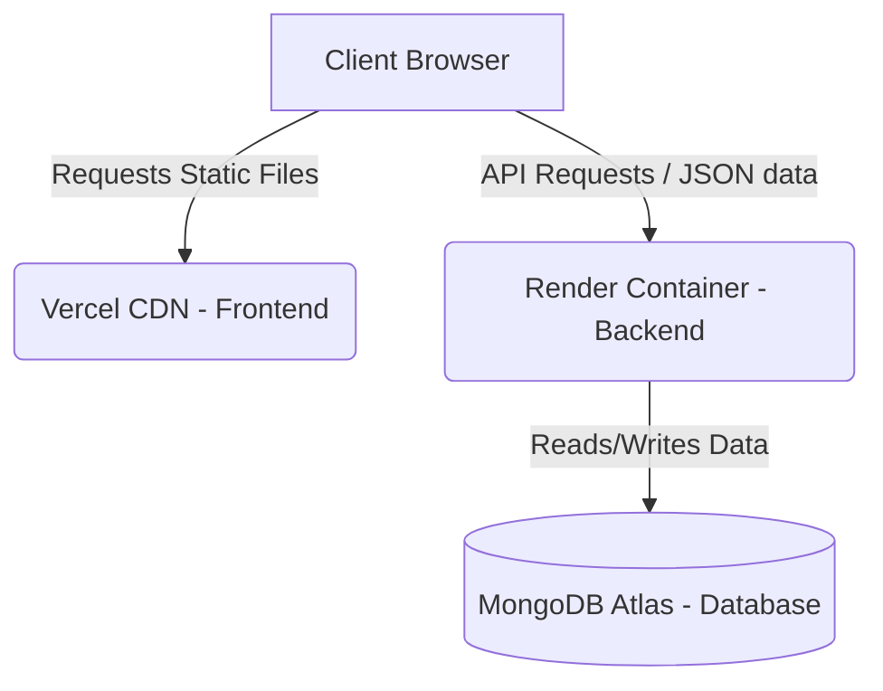

# 🚀 AyurPulse Deployment & Architecture Interview Guide

This guide explains how **AyurPulse** is deployed in the cloud and provides simple, direct answers to questions an interviewer might ask you about the deployment and hosting architecture.

---

## 🗣️ The "Elevator Pitch": How I Deployed This Project
*(Here is a simple, 1-paragraph summary you can read or say directly to an interviewer to explain your deployment)*

> "I deployed this full-stack application by separating the frontend, backend, and database to run on their own optimized platforms for free. The React frontend is hosted on **Vercel** which serves it globally from a fast CDN and automatically handles Single Page Application routing redirects. The FastAPI backend runs in a containerized environment on **Render** which auto-builds from my GitHub repository using a stable Python 3.11 environment. Finally, all the dynamic user data and treatment plans are persisted on a cloud-hosted **MongoDB Atlas** database, connecting securely using environment secrets. This gives us a fully live, automated, and secure system running completely in the cloud."

---

## 🏛️ 1. The Cloud Architecture (In Simple Terms)

Instead of running everything on a single computer, AyurPulse uses a **Decoupled Architecture** (meaning the frontend, backend, and database are hosted on three separate platforms).

### Why is this a real-world approach?
* **Independent Scaling:** If millions of users visit the frontend, Vercel handles it instantly without slowing down the database or backend.
* **Separation of Concerns:** The React code has nothing to do with Python dependencies, and the Python backend has nothing to do with React build tools.
* **Cost & Speed:** Static files (HTML/CSS/JS) are served from Vercel's global CDN (closer to the user), while the backend (Render) only handles data operations.

---

## ⚙️ 2. How the Services are Configured

### A. The Database (MongoDB Atlas)
* Hosted on a **free M0 Sandbox**.
* **IP Access:** Configured to accept traffic from anywhere (`0.0.0.0/0`) because free hosting platforms like Render change their outgoing IP addresses dynamically.

### B. The Backend (FastAPI on Render)
* **Python version:** Pinned to `3.11.9` using `.python-version` and `runtime.txt` to ensure pre-compiled packages (like Pydantic and PyTorch) install instantly without compiler errors.
* **Web Server:** Runs `uvicorn app.main:app` listening on host `0.0.0.0` and port `$PORT` (assigned dynamically by Render).
* **Health Check:** Configured to ping `/api/v1/health` periodically. If the server goes down, Render detects it and automatically restarts it.

### C. The Frontend (React/Vite on Vercel)
* **Root Directory:** Set to `Ayurpulse/frontend`.
* **API Connection:** Connects to the backend via the `VITE_API_URL` environment variable.
* **SPA Routing Rewrite (`vercel.json`):** Directs Vercel to route all pages (like `/login` or `/dashboard`) to `index.html` so React Router can handle them. Without this, refreshing a subpage returns a 404.

---

## 💬 3. Interviewer Q&A (Copy-Pasteable Answers)

### Q1: Why did you choose Vercel for the frontend and Render for the backend instead of hosting them together?
> **Answer:** "I wanted to follow the modern industry-standard **decoupled architecture**. Statically hosting the React app on Vercel serves it from a global CDN, ensuring fast load times. The FastAPI Python backend is containerized on Render, which is optimized for running server side code. This separation makes it easier to scale and maintain."

### Q2: What is the purpose of the `vercel.json` file in your frontend?
> **Answer:** "Since our React app is a Single Page Application (SPA), it uses client-side routing. If a user refreshes their browser on a route like `/login` or `/dashboard`, the host tries to find a physical file named `login` and returns a 404 error. The `vercel.json` file contains rewrite rules that direct Vercel to serve `index.html` for all routes, allowing React Router to successfully handle the path."

### Q3: Why did you pin your Python version using `.python-version` and `runtime.txt`?
> **Answer:** "By default, Render builds services using the latest Python version, which was Python 3.14. Because some packages in our `requirements.txt` (like `pydantic-core`) do not have pre-built compilation wheels for Python 3.14 yet, the build process tried to compile them from source using Rust, which failed due to filesystem permissions. Pinned to stable `3.11.9`, the build succeeded instantly using pre-compiled wheels."

### Q4: How does your frontend know where the backend API is located?
> **Answer:** "I configured the backend URL as an environment variable (`VITE_API_URL`) in Vercel. In the React code, our Axios configuration reads this variable (`import.meta.env.VITE_API_URL`) at build time to direct all HTTP calls to the deployed Render server instead of local host."

### Q5: How did you secure your sensitive API keys (Groq, HuggingFace, JWT keys) in production?
> **Answer:** "None of my secrets are committed to the public Git repository. Instead, I use environment variables in the Render configuration settings. Render injects these variables into the container environment at runtime, where my Python configuration class (`settings.py`) reads them securely."

### Q6: I noticed the first page request took a long time to load. Why is that?
> **Answer:** "Because I am using the free hosting tiers for this prototype, the Render container goes into 'sleep mode' after 15 minutes of inactivity to save resources. When a user sends the first request after a period of sleep, it triggers a 'cold start' which takes about 30 seconds to wake the container and database back up. In a commercial environment, we would use a paid instance with zero downtime/constant uptime to eliminate this cold start."
