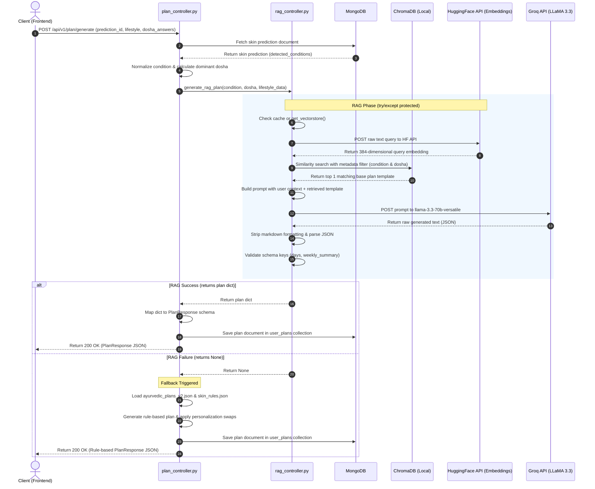

# 🌿 RAG-Enhanced Personalized Plan Generation: Technical & Interview Guide

This guide covers the technical architecture, implementation details, key design decisions, and potential interview questions for the **Retrieval-Augmented Generation (RAG)** wellness plan generation system in **AyurPulse**.

---

## 📌 Table of Contents

1. [Architectural Overview](#1-architectural-overview)
2. [Data Ingestion Pipeline (`ingest_plans.py`)](#2-data-ingestion-pipeline-ingest_planspy)
3. [The Generation Flow (`plan_controller.py` + `rag_controller.py`)](#3-the-generation-flow-plan_controllerpy--rag_controllerpy)
4. [Deep Dive: Key Technical Decisions](#4-deep-dive-key-technical-decisions)
   - [HuggingFace Inference API vs. Local Embeddings](#1-huggingface-inference-api-vs-local-embeddings)
   - [Lazy Loading ChromaDB for Server Resilience](#2-lazy-loading-chromadb-for-server-resilience)
   - [Groq LLaMA 3.3 70B & Parameter Choices](#3-groq-llama-33-70b--parameter-choices)
   - [Defensive Markdown Stripping & Parsing](#4-defensive-markdown-stripping--parsing)
   - [Multi-Layered Fallback Resilience Pattern](#5-multi-layered-fallback-resilience-pattern)
5. [Step-by-Step Execution Sequence](#5-step-by-step-execution-sequence)
6. [Interview Q&A (Ready-to-Answer)](#6-interview-qa-ready-to-answer)
7. [Glossary of Terms](#7-glossary-of-terms)

---

## 1. Architectural Overview

AyurPulse transitions from a static, rule-based template system to an AI-powered personalized plan generator using RAG. 

### Why RAG?
- **Grounding & Safety**: Restricts LLM hallucinations by forcing the model to base its advice on curated, expert-approved Ayurvedic plans.
- **Dynamic Personalization**: Tailors daily routines (morning/evening), diet plans, and yoga practices to individual user profiles (age, sleep quality, stress levels, hydration) instead of using one-size-fits-all templates.
- **Resilience**: Operates with a rule-based fallback system. If any AI subsystem fails (due to API rate limits, network outages, or parse failures), the system transparently falls back to rule-based generation with zero user-facing downtime.

```
                  ┌────────────────────────┐
                  │   User Submits Quiz    │
                  └───────────┬────────────┘
                              │
                              ▼
                  ┌────────────────────────┐
                  │   plan_controller.py   │
                  └───────────┬────────────┘
                              │
             ┌────────────────┴────────────────┐
             ▼                                 ▼
   [ RAG Pipeline (Primary) ]        [ Rule Engine (Fallback) ]
   ┌────────────────────────┐        ┌────────────────────────┐
   │   rag_controller.py    │        │  ayurvedic_plans.json  │
   │                        │        │          +             │
   │  1. Vector DB Lookup   │        │     skin_rules.json    │
   │     (ChromaDB Filter)  │        └──────────┬─────────────┘
   │  2. Top Plan Retrieved │                   │
   │  3. Groq LLaMA 3.3 70B │                   │
   │     Personalization    │                   │
   │  4. Parse & Validate   │                   │
   └─────────┬──────────────┘                   │
             │                                  │
             ├──────────────────────────────────┘
             ▼
   ┌────────────────────────┐
   │ Save to MongoDB &      │
   │ Return PlanResponse    │
   └────────────────────────┘
```

---

## 2. Data Ingestion Pipeline (`ingest_plans.py`)

Before RAG can retrieve documents, a knowledge base must be built. The ingestion script [ingest_plans.py](file:///c:/Users/Dell/Desktop/Ayurpulse/app/utils/ingest_plans.py) indexes existing expert-written plans into ChromaDB.

1. **Source Data**: Reads `ayurvedic_plans_v2.json` which contains 15 base templates (5 skin conditions × 3 dominant doshas).
2. **Text Processing**: Converts each plan variant into a structured, highly descriptive plain-text representation (detailing Day 1-7 morning routines, diets, evening routines, yoga, and weekly summaries).
3. **Metadata Structuring**: Wraps the text inside a LangChain `Document` containing critical metadata:
   ```json
   {
     "condition": "acne",
     "dosha": "pitta_dominant",
     "plan_id": "ACNE_PITTA"
   }
   ```
4. **Vector Embedding**: Uses the remote `HuggingFaceInferenceAPIEmbeddings` with the `sentence-transformers/all-MiniLM-L6-v2` model (384 dimensions) to convert text into vector embeddings.
5. **Storage**: Saves the embeddings and document metadata to disk in `./chroma_db` using **ChromaDB**.

---

## 3. The Generation Flow (`plan_controller.py` + `rag_controller.py`)

When `/api/v1/plan/generate` is hit, the backend performs the following step-by-step workflow:

### A. Initialization & Context Building ([plan_controller.py](file:///c:/Users/Dell/Desktop/Ayurpulse/app/controllers/plan_controller.py))
- Fetches the user's AI-detected skin condition from MongoDB (e.g., `acne`, `dark_spots`).
- Computes the user's dominant dosha based on their quiz answers (e.g., `pitta_dominant`).
- Compiles lifestyle factors into a simplified structure:
  ```python
  lifestyle_data = {
      "sleep_hours": "poor" if "poor_sleep" in request.lifestyle else "normal",
      "stress_level": "high" if "high_stress" in request.lifestyle else "normal",
      "water_intake": "low" if "low_water" in request.lifestyle else "normal",
      "exercise_frequency": "unknown"
  }
  ```
- Calls `generate_rag_plan(...)` in [rag_controller.py](file:///c:/Users/Dell/Desktop/Ayurpulse/app/controllers/rag_controller.py).

### B. Retrieval & Prompt Synthesis ([rag_controller.py](file:///c:/Users/Dell/Desktop/Ayurpulse/app/controllers/rag_controller.py))
1. **Lazy Load DB**: Checks if ChromaDB is initialized in memory; if not, loads it using HuggingFace API Embeddings.
2. **Formulate Query**: Combines user details: `"Condition: acne, Dosha: pitta_dominant, Age: 21-30, Sleep: poor, Stress: high, Water: low, Exercise: unknown"`.
3. **Metadata-Filtered Similarity Search**:
   - Queries ChromaDB using a metadata filter:
     ```python
     filter = {
         "$and": [
             {"condition": condition},
             {"dosha": dominant_dosha}
         ]
     }
     ```
   - Restricts search to `k=1` document. This retrieves the *exact* template plan matching the user's condition and dosha.
4. **Construct Prompt**: Injects the retrieved template plan as base guidelines and prompts the LLM to output a personalized version of this plan, adapting the routine to address the user's lifestyle deficits (e.g., adding stress-relief herbs or hydration reminders) while keeping it structurally identical to the target JSON schema.

### C. LLM Generation & Defensive Parsing
- Invokes Groq API (`llama-3.3-70b-versatile` model, low temperature `0.2` for structural determinism).
- Programmatically strips potential markdown code fences (e.g. ` ```json ... ``` `) that LLMs sometimes generate despite formatting commands.
- Decodes the raw JSON and validates all top-level keys (`plan_id`, `title`, `overview`, `dosha_focus`, `days`, `weekly_summary`).

### D. Return and DB Persistence
- Maps the validated dictionary to the FastAPI `PlanResponse` Pydantic model.
- Saves the plan to the `user_plans` collection in MongoDB (associating it with `user_id` and `prediction_id`).
- Returns the plan response. If anything in steps B or C fails, it returns `None`, triggering the static rule-based fallback generator.

---

## 4. Deep Dive: Key Technical Decisions

### 1. HuggingFace Inference API vs. Local Embeddings
* **The Constraint**: The deployment environment has a hard limit of **4GB RAM**.
* **Local Solution (Rejected)**: Running `SentenceTransformer` locally requires loading PyTorch/Transformers and the model binaries into memory (~1.5GB to 2GB overhead). This risks instant Out-of-Memory (OOM) crashes alongside MongoDB, FastAPI, and the skin prediction ML model.
* **Remote API Solution (Chosen)**: By using `HuggingFaceInferenceAPIEmbeddings`, text is sent over HTTP to Hugging Face's hosted inference servers, returning only the 384-dimensional vector. 
* **Impact**: RAM usage on the local server remains at **0MB** for embedding computations, ensuring stable execution under constraint.

### 2. Lazy Loading ChromaDB for Server Resilience
* **Startup Risk**: Loading ChromaDB at the module level (import time) means that if `./chroma_db` is corrupted, missing, or if ingestion hasn't run, the entire FastAPI server will crash immediately on startup.
* **Lazy Initialization (Chosen)**:
  ```python
  _vectorstore = None
  def get_vectorstore():
      global _vectorstore
      if _vectorstore is None:
          _vectorstore = Chroma(...)
      return _vectorstore
  ```
* **Impact**: The server boots instantly and cleanly. Vector DB dependencies are only loaded when the first user request arrives. If loading fails, it is caught safely, returning `None` to transition to the fallback engine.

### 3. Groq LLaMA 3.3 70B & Parameter Choices
* **Model Selection**: `llama-3.3-70b-versatile` is used instead of the 8B parameter model for plan generation. Generating a detailed 7-day plan with complex daily nested details requires deep instruction-following capability to prevent JSON parsing errors.
* **Temperature = 0.2**: Higher temperature causes creative vocabulary changes which break structured JSON formats. A low temperature ensures strict compliance with the target schema and Ayurvedic safety rules.
* **Max Tokens = 4096**: Ensures the LLM doesn't truncate the 7-day calendar output midway.

### 4. Defensive Markdown Stripping & Parsing
LLMs are trained heavily on markdown-formatted code blocks. Often, despite system prompt guidelines ("Do not return backticks"), the model returns:
```markdown
```json
{
  "plan_id": "...",
  ...
}
```
If fed directly to `json.loads()`, this throws a `JSONDecodeError`. We protect our parser using defensive stripping:
```python
if raw.startswith("```"):
    raw = raw.split("```")[1]
    if raw.startswith("json"):
        raw = raw[4:]
raw = raw.strip()
```
This guarantees robust parsing regardless of minor model variance.

### 5. Multi-Layered Fallback Resilience Pattern
The RAG generation pipeline relies on multiple external layers:
1. Local disk read (ChromaDB files)
2. HuggingFace Inference API network call (Embeddings)
3. Groq Cloud API network call (LLM inference)
4. JSON parsing and structure validation

To ensure high availability, each layer is wrapped in individual `try/except` blocks. If any exception is thrown, we log the details and return `None`. 
```python
# plan_controller.py
try:
    rag_plan = await generate_rag_plan(...)
    if rag_plan is not None:
        return build_response(rag_plan)
except Exception as e:
    logger.error(f"RAG plan failed, entering fallback: {e}")

# If we get here, generate the rule-based plan
return generate_rule_based_plan(...)
```
This makes RAG **purely additive**—it enhances personalization but never lowers system reliability below the original rule-based baseline.

---

## 5. Step-by-Step Execution Sequence

Here is the exact runtime trace of the plan generation flow:



---

## 6. Interview Q&A (Ready-to-Answer)

### Q1: What is the core architecture of your plan generation system, and why did you design it this way?
**Answer:** The architecture is a **Retrieval-Augmented Generation (RAG)** pipeline backed by a **Rule-Based Fallback Engine**. 
When a user requests a plan, the system uses a vector database (ChromaDB) to retrieve an expert-curated Ayurvedic base plan matching their specific skin condition and dosha. It then prompts an LLM (`llama-3.3-70b-versatile` via Groq) to personalize this plan based on the user's age, sleep, stress, and water intake. 
I designed it this way to solve the primary trade-off of LLMs in production: **Safety vs. Flexibility**. If we used pure zero-shot LLM prompts, the model would hallucinate treatments. By using RAG, the LLM is forced to use our verified Ayurvedic ingredients and structures. By keeping the rule engine as a fallback, we guarantee high availability even if external APIs fail.

---

### Q2: How did you implement vector storage and similarity search under tight hardware constraints?
**Answer:** The development machine was constrained to **4GB of RAM**. To implement similarity search without crashing the system:
1. **API-based Embeddings**: Instead of running embedding models locally via PyTorch (which uses ~1.5GB of RAM), I integrated `HuggingFaceInferenceAPIEmbeddings`. The embedding calculations happen remotely, using **0MB** of local memory.
2. **ChromaDB**: We used ChromaDB as a lightweight, disk-persisted vector store.
3. **Metadata Filtering**: Rather than performing a broad similarity search on the whole database (which could return irrelevant conditions), I applied a metadata filter: `{"$and": [{"condition": condition}, {"dosha": dominant_dosha}]}`. This guarantees that we retrieve the exact reference plan template we need, reducing search overhead and ensuring clinical consistency.

---

### Q3: Why did you choose Lazy Loading for ChromaDB?
**Answer:** Eager loading database collections at import time is a common anti-pattern. If ChromaDB initialization fails (e.g., the `./chroma_db` files are missing, locked, or corrupted), loading at import time crashes the entire FastAPI process, preventing the server from starting.
By implementing lazy loading via a global cache check:
```python
def get_vectorstore():
    global _vectorstore
    if _vectorstore is None:
        _vectorstore = Chroma(...)
    return _vectorstore
```
The FastAPI application starts up instantly and safely. The vector store is only loaded upon receiving the first plan request. If it fails to load, the error is caught, the controller logs it, returns `None`, and routes the request directly to the rule engine fallback.

---

### Q4: LLMs are notoriously non-deterministic. How do you guarantee the generated plans conform to your API schemas?
**Answer:** We enforce schema alignment through three strategies:
1. **Low Temperature**: We set the temperature to `0.2` on the Groq API, forcing the LLM to remain highly deterministic and follow the prompt instructions closely.
2. **Few-Shot In-Context Schema Definition**: The prompt includes the exact JSON schema required, showing the model how to structure days, routines, and nested arrays.
3. **Defensive Parsing & Pydantic Validation**: Before returning the response, we programmatically strip any markdown tags and validate the parsed JSON using Pydantic schemas. If keys are missing or fields are malformed, we reject the output and trigger our rule-based fallback rather than sending bad data to the frontend.

---

### Q5: How does your system handle network failures or API rate limits on HuggingFace and Groq?
**Answer:** The system implements a **fault-tolerant fallback pattern**. The RAG pipeline relies on external network requests (HuggingFace for embeddings and Groq for generation). Every network call and parsing step is wrapped in a `try/except` block. 
If an API is down, returns an error, or hits rate limits, the exception is caught and logged. The RAG controller returns `None`, and the plan controller immediately executes the local rule-based plan generator. The end user still receives a valid plan under 200ms, and the API maintains 100% uptime.

---

### Q6: Why did you use `llama-3.3-70b-versatile` instead of a smaller 8B model for RAG generation?
**Answer:** I evaluated smaller models like LLaMA 3.1 8B. While faster, smaller models struggle with complex, long-context instructions. A 7-day Ayurvedic plan involves nested JSON arrays (daily routines, ingredients, procedures, diet restrictions) and strict schema keys. 
Smaller models frequently fail to output valid JSON over long sequences, resulting in syntax errors or missing keys. `llama-3.3-70b-versatile` has much stronger instruction-following capabilities, handles nested JSON outputs reliably, and runs with high speed on Groq's LPU hardware, making the latency difference negligible.

---

### Q7: If you had to scale this system to handle 10,000 requests per minute in production, what bottlenecks would you expect and how would you resolve them?
**Answer:** At that scale, the primary bottlenecks would be:
1. **Groq API Rate Limits**: Groq's cloud endpoints enforce requests-per-minute (RPM) and tokens-per-minute (TPM) limits. I would resolve this by:
   - Implementing **Redis Caching**: If two users have the same condition, dosha, and lifestyle traits, we can serve a cached version of the RAG plan without hitting the LLM.
   - Using **local inference clusters** or self-hosting the LLM on cloud GPUs (using vLLM or Ollama) once hardware constraints are lifted.
2. **HuggingFace API Latency**: A remote HTTP call for every embedding query adds network latency. I would replace the remote API with a **local embedding model** running inside a containerized microservice using ONNX runtime, which is fast and lightweight.
3. **FastAPI Blocking**: Ensure all external calls use asynchronous client libraries (`httpx.AsyncClient` or native async drivers) to prevent network-bound threads from blocking the FastAPI event loop.

---

### Q8: What is the difference between RAG and fine-tuning an LLM, and why was RAG the right choice here?
**Answer:** 
* **Fine-Tuning** updates the actual weights of the neural network. It teaches the model a new tone, style, or specific grammar but is costly, takes hours/days, and doesn't prevent hallucinating factually incorrect data.
* **RAG** acts like an "open-book exam." We retrieve the correct text and give it to the model in the context window.
For AyurPulse, RAG was the correct choice because:
- **No training cost**: We can update, add, or delete plans in our database instantly without retraining.
- **Strict clinical control**: We can guarantee the model only suggests ingredients present in our retrieved plans.
- **Resource limits**: We did not have the GPU cluster required to fine-tune a 70B parameter model.

---

## 7. Glossary of Terms

* **RAG (Retrieval-Augmented Generation)**: A technique that improves LLM responses by retrieving relevant documents from an external dataset and appending them to the model's prompt.
* **Vector Store**: A database (e.g., ChromaDB) designed to index and search high-dimensional vectors representing text.
* **Embedding**: A numerical vector (array of floating-point numbers) that represents the semantic meaning of a word, sentence, or document.
* **Cosine Similarity**: A metric used to determine how similar two vectors are. In NLP, it measures how close the meanings of two pieces of text are.
* **Lazy Loading**: Delaying the loading or initialization of a resource (e.g., vector database, model weights) until it is first requested, reducing startup memory footprints.
* **Graceful Degradation (Fallback)**: A design pattern where a system drops back to a simpler, more robust mechanism (e.g., static JSON templates) if its advanced systems (e.g., LLM APIs) fail.
* **Instruction Tuning**: The process of training LLMs to follow specific prompts and formats (like JSON) rather than just completing sentences.
* **JSON Code Fences**: Markdown wrapper text (` ```json ... ``` `) used to display JSON in code format, which must be stripped before parsing with standard JSON packages.
